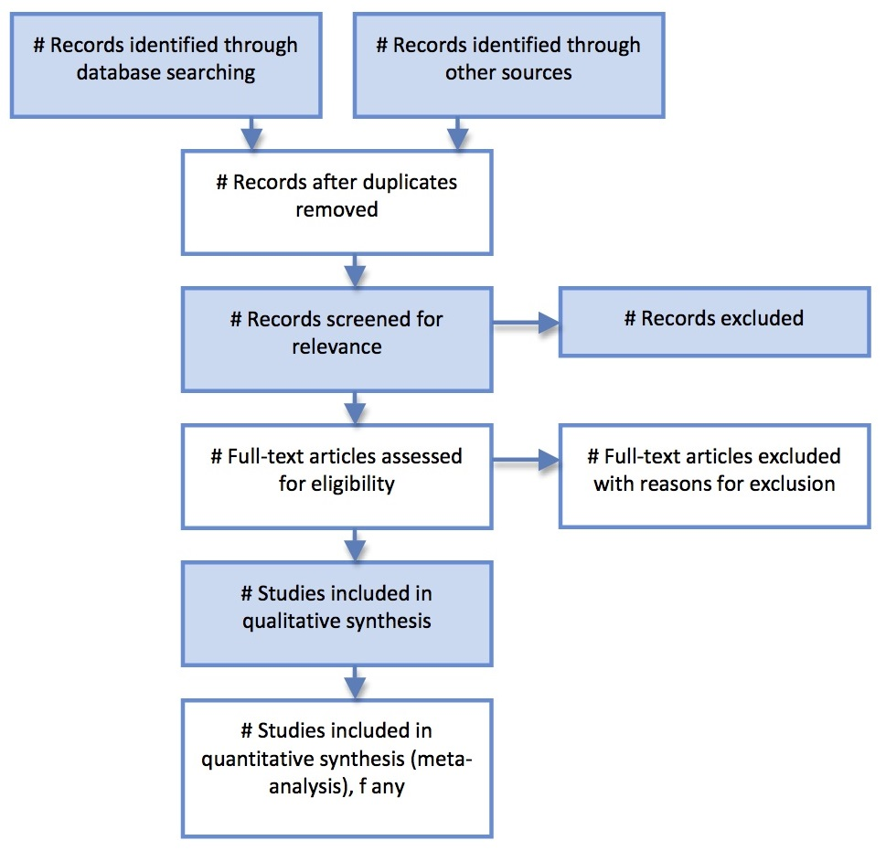

```{r setup, include=FALSE}
knitr::opts_chunk$set(echo = FALSE)
library(metafor)
```

## Meta-Analysis

Meta-analysis is the statistical combination of two or more studies. 

It forms the analytic component of a quantitative systematic review.

Meta-analyses of high quality randomised trials are considered to be the **highest level of available evidence** for health care interventions. 

Useful for:

* Improving *precision* (I.e. If many small studies)
* Answering *ancillary* questions (I.e. Non-primary outcomes)
* Address *conflicting* studies (I.e. Explore differences/compare pooled outcomes)

## Talk parts | Outline

1. Systematic reviews
2. Meta-analysis modelling in R
3. Forest plots
4. Funnel plots 
5. Risk of bias visualisation

## Systematic reviews | Planning

Systematic review is a research methodology identifying relevant literature using a *structured* and *pre-specified* approach to answer a research question. 

Detailed protocols are expected as standard part of the methodology.

Lots of tools are available:

> - Local library can often offer support
> - PROSPERO (registry of systematic review protocols)
> - PRISMA (**P**referred **R**eporting **I**tems for **S**ystematic reviews and **M**eta-**A**nalyses)
> - [Cochrane Handbook](https://training.cochrane.org/handbook)

## Systematic reviews | Performing

```{r out.width = "500px", fig.align = 'center'}

```

## Systematic reviews | Getting data

```{r fig.align = 'center'}
DiagrammeR::mermaid('images/extraction_flow.mmd', 
                  height = 350, width = 350)
```

## Meta analysis | A primer
Meta-analysis requires two things:

 - Effect size/measure
 - Some measure of variance

Individual study contributions to the pooled effect is based on the inverse of their variance.

We use variance also to determine $\tau^2$ which is important for Random effects meta-analysis.

For binary outcome data, the *Mantel-Haenszel* method is generally preferred.

## Meta analysis | A primer II

For example, to calculate study weight if using Risk Ratio; M-H:

$$w_k = \frac{(a_k+b_k)c_k}{n_k}$$
Where :

 * a = number of events in intervention group
 * b = number of non events in intervention group
 * c = number of events in control group
 * n = total number of included patients

This is then used to determine a weighted average effect. 

## Practice | Data from {metafor}
Cochrane review of Cholera vaccines:

*Graves, P. M., Deeks, J. J., Demicheli, V., & Jefferson, T. (2010). Vaccines for preventing cholera: Killed whole cell or other subunit vaccines (injected). Cochrane Database of Systematic Reviews, 8, CD000974.*

```{r echo=T}
dat<-metafor::dat.graves2010
```

```{r}
knitr::kable(head(dat, n=2), format = 'simple')
```

## Practice | Data description
```{r echo=F, results='asis'}
tabl <- "
|Column|Description|
|--|--|
study | Author and year | 
ai | number of cholera cases in vaccinated group |
n1i | number of individuals vaccinated |
ci | number of cholera cases in placebo group |
n2i | number of individuals in placebo group |
"
cat(tabl)
```

There are `r nrow(dat)` studies included in this data set.

## Practice | Binary outcome variable
We can use the `meta::metabin` function to analyse this data.
```{r echo=T}
mod <- meta::metabin(
  event.e = ai, #exposed to vaccine and had cholera
  n.e = n1i, # count of those exposed to vaccine
  event.c = ci, # not exposed to vaccine, had cholera
  n.c = n2i, # count of those not exposed to vaccine
  data = dat
)
```

## Practice | Review model
```{r echo = F}
mod
```

## Practice | Summary model
```{r echo = T}
summary(mod)
```

## Practice | Alter parameters
```{r echo = T}
u_mod <- update(mod, sm = 'RD')
summary(u_mod)
```

## Practice | Forest plot
We can use the `meta::forest` function to output a plot.
```{r echo = T, fig.width=10, fig.height=5.25, dpi =92, out.height="100%", out.width= "80%"}
forest_plot <- meta::forest(u_mod, yaxs="i")
```

## Practice | Model function
For consistency and given the large number of parameters, it is helpful to define a single model function that you then run:
```{r, echo = T}
model_fun = function(data_analysis, ...){
  'Standard model using MH model, RD as outcome and uses REM (I-V)'
  meta::metabin(event.e=ai,
                n.e=n1i,
                event.c=ci,
                n.c = n2i,
                studlab=study, #specify study label
                method = 'Inverse',
                sm='RR', # Summary measure
                data=data_analysis,
                overall = T,
                comb.fixed=F, #use REM, uses Mantel-Haenszel
                method.tau = "DL",
                prediction = T,
                level.predict = 0.95,
                ...)
}
```

## Practice | Using the model
```{r, echo = T}
mod = model_fun(dat)
summary(mod)
```

## Practice | Plot function
There are *>100 parameters* you can edit in `meta::forest`, so worth spending some time deciding what matters for your plot/project and refining a single function you can call repeatedly.
```{r, echo=T}
forest_main = function(for_model, ...){
  meta::forest(for_model, #model input
               study.results = TRUE, # show individual studies
               print.byvar=FALSE, # don't put 'surgery setting = ' byvar
               test.overall.random = TRUE, #overall random effects model
               overall.hetstat = TRUE, #overall heterogeneity effects
               resid.hetstat=FALSE, # not residual hetstat as no subgroups
               hetstat=FALSE,
               prediction = TRUE,addrow=T,
               addrow.overall=F, fs.hetstat = 12,
               fs.predict = 12, fs.test.overall = 12,
               fs.random.labels =12, leftcols = c("studlab", "event.e", "n.e", "event.c", "n.c"),leftlabs = NULL,rightcols = c("effect.ci"),
               squaresize = 0.4,
               plotwidth = '180mm',
               ...)
}
```

## Practice | Using plotting function
```{r echo = T, fig.width=14, fig.height=5.25, dpi =92, out.height="100%", out.width= "80%"}
forest_main(mod) 
```

## Practice | Neater graphs
```{r echo = T, fig.width=14, fig.height=5.25, dpi =92, out.height="100%", out.width= "80%"}
mod$label.e <- 'Vaccine'
mod$label.c <- 'Placebo'
mod$label.left <- 'Favours vaccine'
mod$label.right <- 'Favours placebo'
forest_main(mod) 
```

## Practice | Heterogeneity

 - Common problem in meta-analysis is how to consider between trial heterogeneity
    + Statistical heterogeneity is measured using the I^2, tau^2 and Chi^2 statistics
 - This can be introduced from clinical, methodological or statistical heterogeneity.
 
 - Explore with subgroup analyses
 
 - Visualise impact with the *prediction interval*

 - *Use Random Effects Modelling*

## Practice | Subgroup analyses
```{r echo = T}
dat$LMIC <- sample(c('LMIC', 'HIC'), size=nrow(dat), replace = T)
  
mod <- model_fun(dat)

l_mod <- update(mod, byvar = LMIC)
```

## Practice | Subgroup analyses

```{r echo = T, fig.width=16, fig.height=6, dpi =92, out.height="100%", out.width= "80%"}
forest_main(l_mod,print.subgroup.labels = TRUE) #used ellipsis so can pass further arguments
```

## Practice | Funnel Plots
Determining if there is evidence of publication bias is important.

This is conventionally done using a funnel plot, which plots the effect size against standard error.
```{r, echo = T}
funnel(mod)
```

## Practice | Funnel plot with contour

```{r, echo = T, fig.width=16, fig.height=8, dpi =92, out.height="100%", out.width= "80%"}
funnel(mod, comb.random=T, 
       contour.levels = c(0.9,0.95, 0.99), 
       col.contour = c('grey50', 'grey70', 'lightgrey'), 
       col = 'darkred', bg = 'red1', pch=21, yaxis='se')

legend('topleft', c('p < 0.1', ' p < 0.05', 'p < 0.01'), 
       cex=0.8, col=c('grey50', 'grey70', 'lightgrey'), 
       pch=c(15,15,15), pt.cex=c(2, 2,2), title = 'Contour shading',
       horiz=T, inset=c(0,-0.125), xpd = T)
```

## Useful resources
 - The `{robvis}` package for risk of bias visualisation
 - The `{metafor}` package for using calculated event rates (e.g. Odds Ratios etc)
 - [Mathias Harrer - Doing Meta-Analysis in R](https://bookdown.org/MathiasHarrer/Doing_Meta_Analysis_in_R)
 - [Cochrane Handbook](https://training.cochrane.org/handbook)
 - The `{metaverse}` group of packages (in development)

